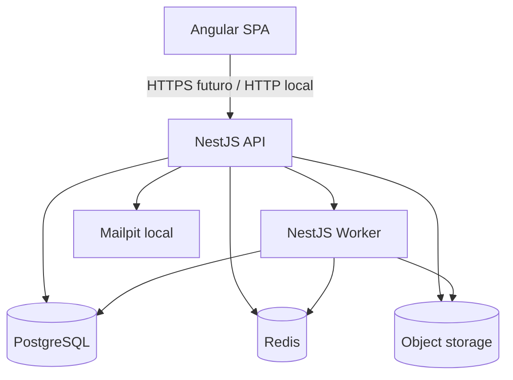

# Visao de containers

Status: ACCEPTED

## Responsabilidades

- Angular SPA: experiencia de usuario.
- NestJS API: validacao, autorizacao futura e orquestracao.
- NestJS Worker: processamento futuro sem exposicao publica.
- PostgreSQL: persistencia relacional futura.
- Redis: infraestrutura futura para cache ou filas.
- Object storage: arquivos originais e artefatos.
- Mailpit: e-mail local apenas para desenvolvimento.

Documentos relacionados:

- [Infraestrutura local](local-infrastructure.md)
- [Fluxo de dados](data-flow-overview.md)
