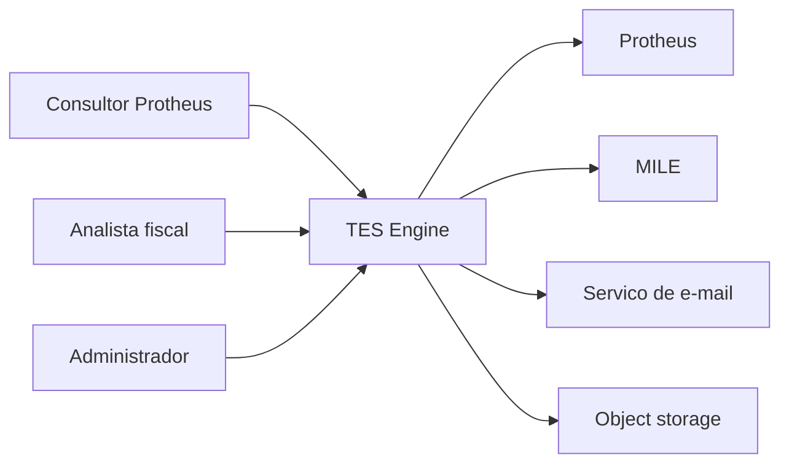

# Contexto do sistema

Status: ACCEPTED

Esta visao equivale ao nivel de contexto do C4.

## Limites de confianca

- Navegador do usuario e externo ao backend.
- API publica valida entradas.
- Worker nao e publico.
- Object storage deve ser privado.
- Arquivos enviados sao entradas nao confiaveis.
- Protheus e MILE sao sistemas externos ao TES Engine.

Documentos relacionados:

- [Visao geral](system-overview.md)
- [Fronteiras de seguranca](security-boundaries.md)
